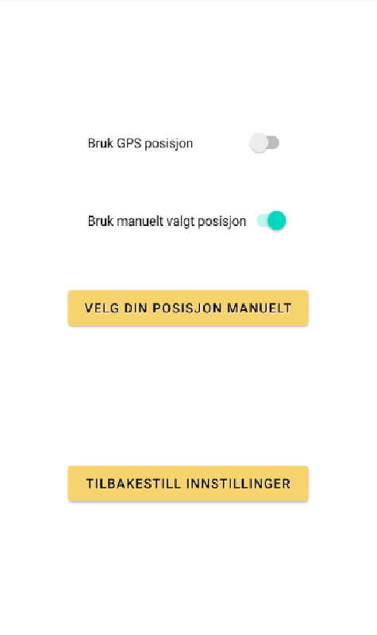

# Duppert

En applikasjon utviklet i Android Studio som del av emnet IN2000 på Universitet i Oslo, våren 2021.

## API

Applikasjonen benytter [API-er fra Metrologisk Institutt](https://in2000.met.no/2021/1-badetemp) til å hente ut koordinater for badesteder i Oslo-regionen, og temperaturer og varsler for disse badestedene.

## Skjermbilder

På hjemskjermen kan brukeren navigere til kartet, favoritter, og instillinger.

På kartet er det flere nåler. De røde nålene er badesteder som brukeren kan trykke på for å få informasjon om stedet. Den blå nålen er brukerens posisjon.

Hvis brukeren trykker på en rød nål vil de få opp navnet på badestedet, luft- og vanntemperatur, og et korttidsvarsel for lufttemperaturen. Brukeren kan trykke på hjertet for å lagre stedet i favorittene sine. Hvis brukeren trykker på "mer informasjon om stedet" vil de bli tatt til Oslo kommune sine nettside som har mer informasjon om badestedet, hvis dette er tilgjengelig for badestedet.

Brukeren kan søke etter badesteder ved å trykke på forstørrelsesglasset over kartet.

Brukeren kan finne nærmeste badested i forhold til deres posisjon ved å trykke på nålen over kratet med spørsmålstegn.

Brukeren kan bestemme laveste luft- og vanntemperatur de ønsker ved å trykke på de tre horisontale stripene over kartet.

Brukeren kan se en oversikt over favoritt-stedene deres og navigere til dem raskere ved å trykke på "favoritter" på hjemskjermen.

Brukeren kan velge om applikasjonen skal brukere GPS posisjonen deres eller om brukeren skal sette posisjonen deres på kartet manuelt ved å trykke på "innstillinger" på hjemskjermen.

